# Hi, I'm Jeremie! 👋

### Software Developer | Open-Source Advocate | Systems Tinkerer

I build software that is fast, accessible, and respectful of the user.

Currently, I'm a Software Developer at **Assent**, where I work with **.NET Core** and **Angular** to build complex, scalable enterprise solutions.

## 🛠 The ZXCV Initiative ([zxcv.fyi](https://zxcv.fyi))
I'm the creator of **zxcv**, a growing collection of free, open-source projects. The mission is simple: provide high-quality tools (for file conversion, SEO, text cleanup, and more) without the ads, trackers, or data-harvesting typical of modern utility sites. 

## 🚀 Projects & Experiments
- **[masm2wasm](https://github.com/jere-mie/masm2wasm):** A Go-powered bridge bringing MASM32 to the web via WebAssembly.
- **[Easy-MASM](https://github.com/jere-mie/easy-masm):** A Dockerized x86 MASM toolchain widely used in academic settings.
- **[Unslop](https://github.com/jere-mie/unslop):** A CLI utility to strip AI-generated artifacts from text.
- **[Wasmtex](https://github.com/jere-mie/wasmtex):** A privacy-focused, browser-side LaTeX and Typst editor.

## 💻 Tech Stack
| Context | Technologies |
| :--- | :--- |
| **Professional** | `.NET Core (C#)`, `TypeScript`, `Angular`, `SQL` |
| **Personal** | `Go`, `React`, `Python`, `Zig`, `WASM` |
| **Infrastructure** | `Docker`, `GitHub Actions`, `Linux` |

## 📊 Stats & Activity

## 📬 Connect with Me
- **Portfolio:** [jeremie.bornais.ca](https://jeremie.bornais.ca/)
- **Writing:** [blog.bornais.ca](https://blog.bornais.ca/)
- **LinkedIn:** [in/jeremie-bornais](https://www.linkedin.com/in/jeremie-bornais/)
- **Email** jeremiedevelops@gmail.com

*"Building tools that empower people, not exploit them."*
